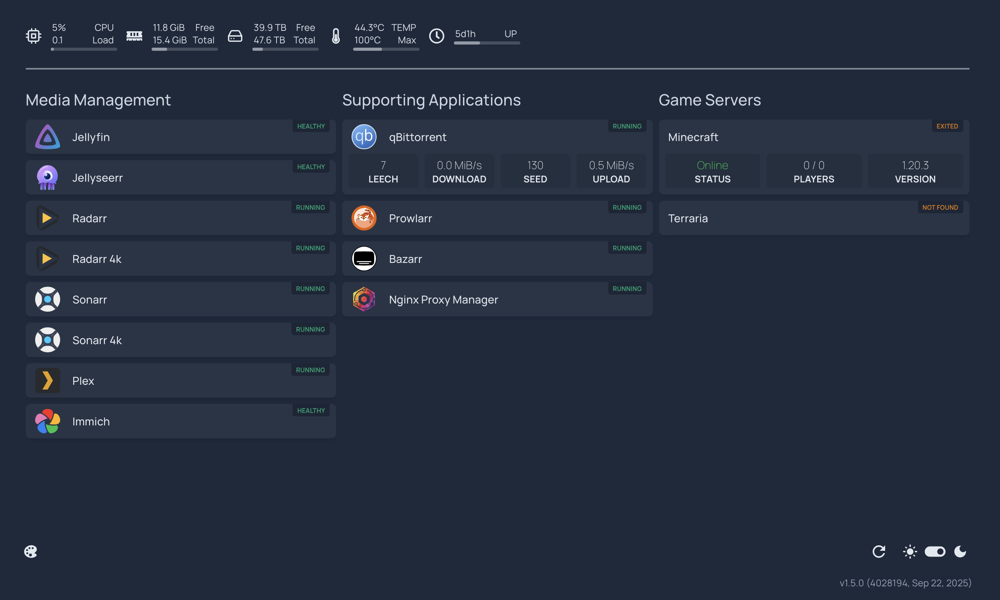
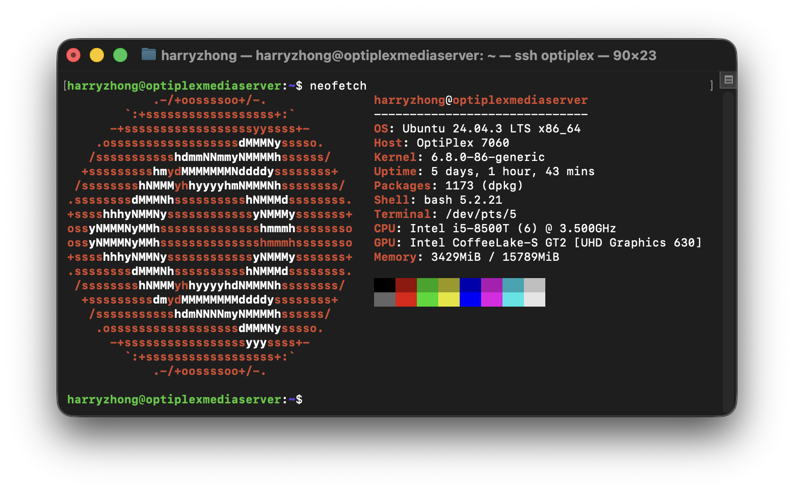

# My Home Server

Docker Compose files, scripts, and documentation for my home server.

 

## Purpose

This server is primarily a media server (Jellyfin and Plex), but also hosts game servers (Minecraft and Terraria), photo backups (Immich), and general file storage (Samba).

## Hardware

Compute:
- Dell OptiPlex 7060 Micro
- Intel i5-8500T
- 16GB RAM
- 256GB M.2 SATA SSD boot drive

Storage:
- 4×16TB WD Ultrastar DC HC550 hard drives
- TerraMaster D4-320 enclosure

## Operating system

Ubuntu 24.04.3 LTS on bare metal. Various Docker containers for each service.

## Filesystem and Redundancy

Drives are formatted as EXT4 to enable hard linking. Mount points for each individual drive are combined using mergerfs. 1 drive is used as a redundancy drive using SnapRAID. SnapRAID is scheduled to sync daily using snapraid-runner and cron.

## Backup

Application data for all Docker containers is saved in `./appdata`, this directory is then incrementally backed up using restic. Backups are done using the 3-2-1 backup strategy which involves having 3 copies of your data, stored on 2 different types of media, with 1 copy stored off-site.

- Copy 1: live copy stored on the boot drive.
- Copy 2: restic backup stored on hard drives.
- Copy 3: restic backup stored on cloud (Google Drive).

Rclone is used alongside restic to enable cloud connectivity for off-site backups.

Backups are scheduled weekly using `./scripts/backup.sh`.

Media library files are currently not backed up due to the size of the library. If I lose my media, it is what it is.

### How to restore `./appdata`

1. Install `restic` and `rclone`.
2. Set up Google Drive `rclone` remote named gdrive.
3. Run the command below.

```bash
restic -r rclone:gdrive:/Backups/optiplexmediaserver restore latest:/home/harryzhong/docker/appdata --target ./appdata
```