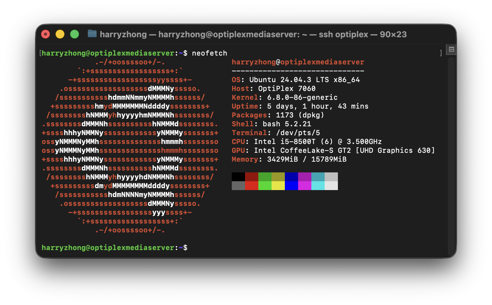

# Home Server

Docker Compose files, scripts, and documentation for my home server.



## Purpose

This server is primarily a media server (Jellyfin and the *arr suite), but also hosts game servers (Minecraft), photo storage and backups (Immich), networking and security infrastructure, and monitoring services.

## Hardware

Compute:
- Dell OptiPlex 7060 Micro
- Intel i5-8500T
- 16GB RAM
- 500GB Samsung 980 NVMe SSD boot drive

Storage:
- 4×16TB WD Ultrastar DC HC550 hard drives
- TerraMaster D4-320 enclosure

## Operating System

Ubuntu 24.04.4 LTS on bare metal. Various Docker containers for each service.

## Services

- **Media & Downloads**: Jellyfin, Seerr, Radarr, Sonarr, Bazarr, Prowlarr, Profilarr, FlareSolverr, and qBittorrent routed through Gluetun (ProtonVPN with port forwarding).
- **Networking & Security**: Caddy (reverse proxy with Cloudflare DNS challenge and CrowdSec bouncer), CrowdSec with Web UI, AdGuard Home (local DNS and ad-blocking), Tailscale (mesh VPN and exit node), and Cloudflare DDNS.
- **Photos**: Immich (photo management with machine learning and PostgreSQL).
- **Game Servers**: Minecraft servers managed through `mc-router` and `lazymc`.
- **Monitoring & Management**: Homepage (dashboard), Uptime Kuma (service monitoring), and Scrutiny (hard drive S.M.A.R.T. monitoring).

## Filesystem and Redundancy

Drives are formatted as EXT4 to enable hard linking. Mount points for each individual drive are combined using mergerfs. 1 drive is used as a redundancy drive with SnapRAID. SnapRAID is scheduled to sync and scrub daily using snapraid-runner and cron.

## Backup

Application data for all Docker containers is saved in `./appdata`. This directory is then incrementally backed up using restic. Backups follow the 3-2-1 backup strategy: 3 copies of data, stored on 2 different media types, with 1 copy stored off-site.

- Copy 1: Live copy stored on the boot drive.
- Copy 2: Local restic backup stored on the hard drive array.
- Copy 3: Off-site restic backup stored in the cloud (Google Drive).

Rclone is used alongside restic to enable cloud connectivity for off-site backups. Application data backups are scheduled daily using `./scripts/backup_appdata.sh`. Immich library files are backed up daily using `./scripts/backup_immich.sh` following the daily SnapRAID run.

### How to restore `./appdata`

1. Install `restic` and `rclone`.
2. Set up a Google Drive `rclone` remote named `gdrive`.
3. Run the command below:

```bash
restic -r rclone:gdrive:Backups/optiplexmediaserver restore latest:/home/harryzhong/home-server/appdata --target ./appdata
```